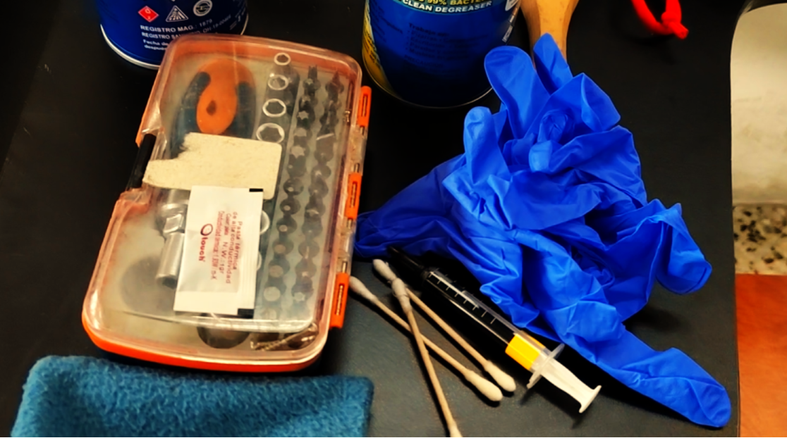
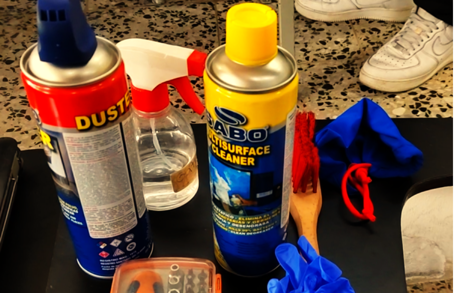
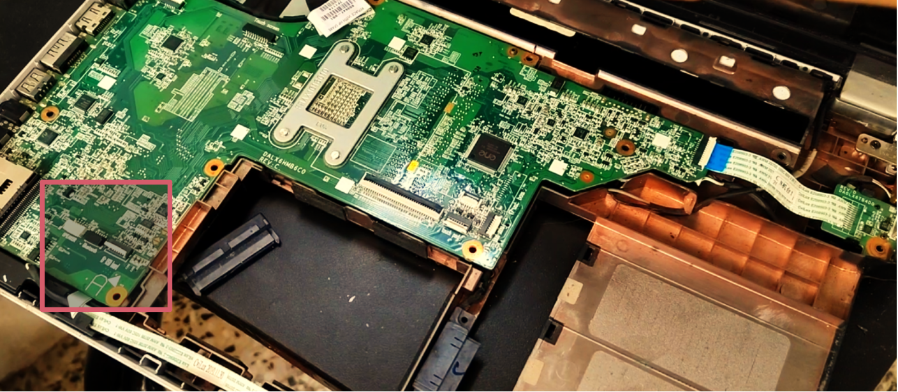

Universidad de San Carlos de Guatemala

Facultad de Ingeniería

Escuela de ciencias y sistemas

Prácticas iniciales

Ing. Floriza Avila

# Informe No.1 / Mantenimiento de una computadora

Jorge Anibal Martínez Letona

Carné: 201317952

## Información del equipo
- HP Pavilion dv6 Notebook PC
- ID Board: 144c
- Versión del BIOS: F.23
- Tipo de procesador: Intel(R) Core(TM) i3 CPU
- Velocidad procesador: 2400 MHz
- Chipset: Intel HM65 Express
- Graphics: AMD Radeon HD 6620G
- Memoria: 2 slots para memoria DDR3 8GB
- Ethernet: integrado 10/100/1000 interfaz de red
- Wireless: Wifi integrado local
- Sistema operativo: Windows 7 home basic preinstalado

## Descripción de los componentes
### Pantalla
Muestra la interfaz del sistema operativo, programas e imágenes. Su resolución y tamaño afectan la calidad visual y la comodidad de uso.

tamaño: pantalla de 15.6 pulgadas.

Resolución: de 1366 x 768 pixeles.

Antena WLAN: Envia y recive señales de comunicación.

Microfono interno: Grabación de sonidos.

Luz webcam: encendido cuando está en uso.

Webcam: Grabación de video y toma de fotografías.

### Procesador
Procesador inter core i5 de primera generación o AMD Phenom II.

Es el cerebro de la computadora, encargado de ejecutar instrucciones y procesar datos. Determina la velocidad y capacidad de respuesta del equipo.

### Memoria Ram
capacidad: Generalmente equipada con 4GB de memoria DDR3, expandible hasta 8GB.

Almacena temporalmente los datos y programas en uso. permitiendo una ejecución rápida y eficiente de las aplicaciones.

### Almacenamiento
Disco duro: Unidades SATA con capacidades que varían entre 320 GB y 500 Gb a 5400 RPM.

Guara permanentemente el sistema operativo, programas, archivos, etc. Un HDD ofrece más capacidad, mientras que un SSD brinda mayor velocidad.

### Gráficos
Tarjeta gráfica: incluye ATI Mobility Radeon HD 5650 con 1 Gb de memoria dedicada.

Procesa imágenes y gráfico, mejorando la calidad visual en los juegos, edición de video y contenido multimedia, puede ser integrada o dedicada.

### Conectividad y puertos
Permiten conectar dispositivos externos como memorias USB, monitores y redes, incluyen USB, HDMI, VGA, Bluetooth, y WIFI.

Puertos USB: Múltiples puertos USB 2.0.

Salida de video: HDMI y VGA.

Conectividad: Wifi 802.11 b/g/n, Bluethoot y Puerto Ethernet RJ-45.

### Unidad óptica
Sirve para leer y grabar discos CD/DVD, útil para instalar softwar, reproducir contenido o hacer copias de seguridad.

tipo: Unidad superMulti DVD +- R/RW con soporte para doble capa.

## Listado de materiales para limpieza
- Isopos
- Trapo
- Alcohol al 90%
- Aire comprimido
- Guantes
- Set de destornilladores
- Destornilladores magneticos
- Pasta térmica
- brocha

## Procedimiento empleado para la limpieza
- Objetivo: Realizar una limpieza interna y externa de la computadora HP Pavilion dv6 para mejorar su rendimiento, disipación de calor y prolongar su vida útil.
- [VIDEO](https://creativeaml.com/)
1. Preparación
	1. Apague la computadora y desconéctela de la corriente eléctrica.
	2. Retire la batería para evitar descargas eléctricas.
	3. Colóquese una pulsera antiestática o toque una superficie metálica para descargar cualquier acumulación de electricidad estática.
	
2. Limpieza externa
	1. Utilice un paño de microfibra seco o ligeramente humedecido con alcohol isopropílico para limpiar la carcasa.
	2. Limpie el teclado con aire comprimido para eliminar el polvo acumulado entre las teclas.
	3. Pase la brocha antiestática por las ranuras de ventilación y puertos.
	
3. Desmontaje para limpieza interna
	1. Con el destornillador de precisión, retire los tornillos de la tapa trasera.
	2. Levante con cuidado la tapa para acceder a los componentes internos.
	
4. Limpieza interna
	1. Use aire comprimido para eliminar el polvo de los ventiladores, disipador de calor y otras superficies difíciles de alcanzar.
	2. Con la brocha antiestática, retire el polvo restante de la placa base y los módulos de RAM.
	3. Si hay acumulación de suciedad en los puertos y ranuras, límpielos con aire comprimido y un hisopo con alcohol isopropílico.
	
5. Cambio de pasta térmica
	1. Retire el disipador de calor desatornillando los tornillos que lo sujetan al procesador y a la GPU (si aplica).
	2. Limpie los residuos de pasta térmica antigua en el procesador y en la base del disipador usando un paño de microfibra humedecido con alcohol isopropílico.
	3. Aplique una pequeña cantidad de pasta térmica nueva en el centro del procesador.
	4. Vuelva a colocar el disipador de calor y atorníllelo en su posición de manera uniforme y cruzada para evitar presión desigual.
	
6. Reensamblado y prueba
	1. Vuelva a colocar la tapa trasera y asegúrese de que todos los tornillos estén bien ajustados.
	2. Inserte la batería y conecte la computadora a la corriente.
	3. Encienda la computadora y verifique que los ventiladores funcionen correctamente y que la temperatura del procesador sea estable.
	4. Realice pruebas de rendimiento para asegurar que todo funcione de manera óptima.

## Resultados
Luego de haber realizado la limpieza y agregar la nueva pasta térmica, se observó una disminución en el calentamiento y menor ruido del ventilador.

## Recomendaciones
1. Se recomienda al técnico o al encargado de la limpieza del equipo, tener el manual de mantenimiento del equipo correcto a dar mantenimiento para proceder a realizar los procedimientos correctos para desarmar la computadora en el orden correcto y así evitar posibles errores o manejo incorrecto de las piezas.
2. Realizar este procedimiento al menos cada 6 meses para evitar sobrecalentamientos.
3. No aplicar aire comprimido directamente a corta distancia en los ventiladores, ya que podría dañarlos.
4. Usar una cantidad moderada de pasta térmica para evitar derrames.

## Solución de errores
Cuando se procedió a ensamblar la computadora se cometió el error de no conectar un puerto USB 2.0 y la conectividad de las bocinas, para ello se procedió a desarmar la computadora y conectar el puerto y las bocinas en las terminales correctas.

## Referencias
[HP MANUAL](https://h10032.www1.hp.com/ctg/Manual/c02657339.pdf?utm_source=chatgpt.com)

 

