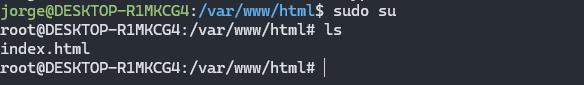
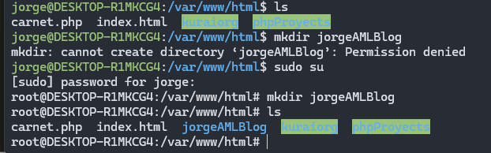
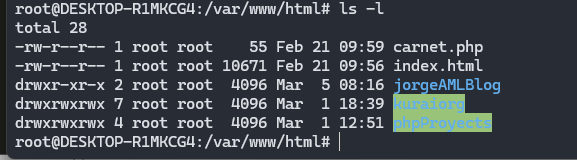
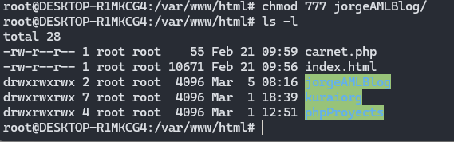
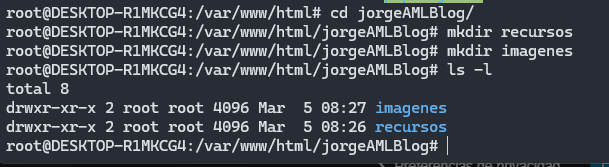
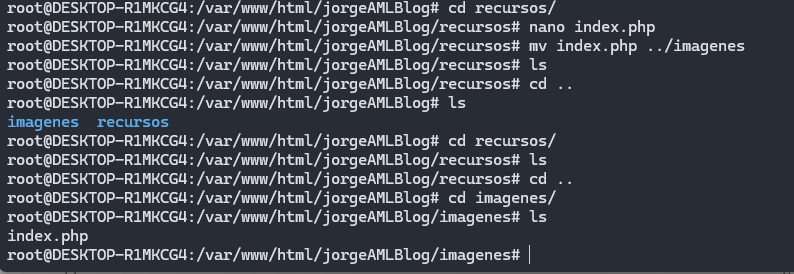
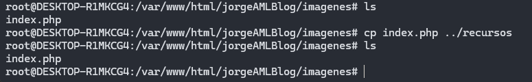
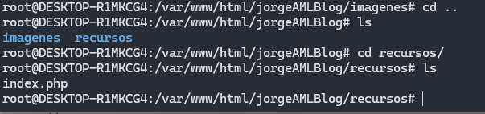
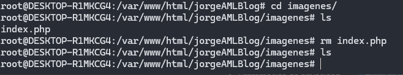
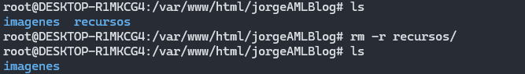

Universidad de San Carlos de Guatemala

Facultad de Ingeniería

Escuela de ciencias y sistemas

Prácticas iniciales

Ing. Floriza Avila

# Informe No.3 / Manual de instalación servidor Apache

Jorge Anibal Martínez Letona

Carné: 201317952

## Introducción
El sistema operativo linux es un software libre que ofrece una variedad de aplicaciones y alto rendimiento para la instalación de servidores locales y en la nube, este manual se enfocará en la instalación de un servidor apache en ubuntu WSL, proporcionando los comandos utilizados durante su ejecución.

### Versión recomendada
Para esta instalación se llevo a cabo desde el sistema operativo Ubuntu WSL, pero el usuario queda libre de usar cualquier distribución de su gusto.

### Requisitos previos a la instalación
Para tener una instalación exitosa del sistema operativo linux, se aconseja tener conocimiento del computador donde se instalará, ya que este puede tener o no una unidad óptica sino la instalación deberá hacerse por medio de USB, pero por experiencia aconsejamos que se realice usando CD o DVD para la instalación, teniendo cuidado del sistema operativo si es X32 o x64.

### Requisitos del sistema
#### Especificaciones mínimas y recomendadas
- 4GB Ram
- 32GB almacenamiento
- Puertos USB
- Unidad óptica (opcional)
- Procesador Intel, AMD
- Tarjeta gráfica

#### Requisitos de software
- si es instalación por medio de USB, cambiar la configuración del BIOS, arrancar desde USB.
- Tener una imagen de Linux en USB, CD o DVD.

### Descarga de la imagen ISO
Para poder descargar la imagen debemos de ir al sitio original de la distribución así como para [Linux Mint](https://www.linuxmint.com/) podemos visitar el sitio web y navegar entre las distintas variantes que ofrece la distribución, o así como [Ubuntu WSL](https://ubuntu.com/desktop/wsl) también podemos visitar su sitio web y podemos verificar su atenticidad y especiales usos que ofrece la distribución.

### Creación del medio de instalación
- Uso de herramientas para crear un USB bootable:
- Windows: Rufus
- Linux: Ventoy
- Mac: terminal, BalenaEtcher

### Configuración del BIOS/UEFI
- Acceder al BIOS
- Habilitar secure boot
- Configurar orden de arranque
- Modo de arranque: Legacy y UEFI.

### Instalación del sistema operativo
- Arranque desde USB Bootable
- Escoger un modo de instalación(mínima, completa, live)
- Partición de disco, automática o SWAP
- Creación de usuario y configuración básica
- Instalación GRUB.

### Primer inicio y Configuración iniciales
Para poder comenzar a utilizar ubuntu debemos de actualizar los paquetes de aplicación que nos ofrece Ubuntu para ello debemos de asegurarnos de estar conectados a internet para inicializar la descarga de paquetes con el siguiente comandos:

> sudo apt update

este comando actualizará los paquetes y software a los más recientes.

Nuestro objetivo se centra en la instalación de un servidor apache, por lo tanto instalaremos Apache y PHP para configurar nuestro servidor.

> sudo apt install apache2

Con este comando procederemos a instalar nuestro servidor Apache.

Luego de la instalación de Apache procederemos a instalar PHP.

> sudo apt install php-cli

Este comando instalará PHP para poder ejecutar el lenguaje en Apache.

Luego de haber instalado Apache y PHP nos aseguraremos que se hayan creado la carpete www/html para ello utilizaremos los comandos:

> cd ..

Para regresar a rutas o acceder a directorios. Primero usaremos el comando ls para reconocer en que carpeta veremos o estan para acceder en el directorio actualizar

> ls

Retrocederemos dos veces para encontrar la carpeta bin y la carpeta variantes

Usaremos el siguiente comando para poder conocer el tipo de escritura de cada carpeta, podremos observar varias nomenclaturas las cuales solo el superusuario podrá modificarlas y otras cualquier usuario dependiendo del tipo de seguridad que se configuren.

> ls -l

Ahora debemos de acceder a nuestra carpeta var/www con el siguiente comando

> cd var/www/

Finalmente podremos ver nuestro archivo index.html que fue generado por Apache.

Ya que vemos que existe un archivo index podemos abrir nuestro navegador para poder ver nuestro servidor vivo!.

Bien, ahora regresaremos a nuestra terminal y accederemos como superusuario con el siguiente comando:

> sudo su

Accederemos como super usuario con las credenciales correctas

Para este ejemplo crearemos un archivo llamado carnet.php como sigue:

> nano carnet.php

Cuando usemos este comando se abrira una interfaz para modificar el contenido del archivo creado con nano, asi como en la siguiente imagen:

Acá debemos de tener cuidado ya que la configuración de las teclas cambian, y no podremos usar el ratón para realizar varias acciones pero si podremos modificar el contenido de nuestra página como cualquier otra en HTML, PHP, etc. Para cerrar debemos de guardar el archivo con CTRL + X.
Ya guardado procederemos a regresar al navegador y revisar nuestro localhost y poner lo siguiente:

> localhost/carnet.php

Esta es una breve y sencilla explicación sobre como configurar un servidor apache en Ubuntu, y de la misma manera debería de poder realizarse en cualquier distribución de Linux.

## Cambio de permisos de escritura
Haremos la demostración de como crear carpetas en Linux y cambiar su rol para que cualquiera pueda modificarlo, estando en la terminal nos ubicaremos en la carpeta de nuestro servidor Apache utilizaremos el siguiente comando

> mkdir [nombre carpeta]

Como estamos en la carpeta Apache debemos de ingresar como super usuario y crear nuestr carpeta.

Vemos distintas tonalidades, la carpeta de azul es la que hemos hecho anteriormente si ingresamos el siguiente comando, podremos ver los permisos de la carpeta en donde solo el super usuario puede modificar

> ls -l

Para cambiar los permisos de la carpeta necesitamos ingresar el siguiente comando en la terminal:

> chmod 777 carpeta

Este comando sirve para que cualquier usuario pueda leer, escribir y ejecutar desde la terminal o fuera de ella.

## Copiar, mover y eliminar archivos

Daremos una explicación sencilla sobre el uso de los comandos ya que contienen una variedad de configuraciones para su uso diario acá veremos lo esencial

> mv origen destino

debemos de utilizar el comando mv para mover algun archivo o directorio y dar la ruta donde se movera, para nuestro ejemplo crearemos dos directorios y un archivo para moverlo de un directorio a otro.

Aquí hemos accedido a la carpeta creada anteriormente y hemos creado dos carpetas más e ingresado el comando para ver los permisos de cada uno, ahora crearemos el archivo 

> nano index.php

En esta imagen hemos creado un archivo con el comando nano index.php lo hemos modificado y lo hemos cambiado de ruta a una arriba en la carpeta imagenes, tomar en cuenta que se utilizó dos puntos para regresar un directorio.

> mv index.php ../imagenes

Y por último hemos verificado que el archivo se haya movido a la carpeta correcta ubicandonos en la ruta y utilizando el comando ls

--- 

Ahora copiaremos el archivo a ambas carpetas con el siguiente comando:

> cp index.php ../recursos

Podemos ver que el archivo se ha copiado en ambos directorios.

---
 
Para borrar el archivo creado anteriormente podemos usar el siguiente comando:

> rm nombre_archivo

De la misma manera podremos borrar un directorio pero antes debemos de asegurarnos que no haya ningún archivo dentro de él:

> rm -r directorio

---

### Recomendaciones

- Usualmente linux no pedirá realizar modificaciones siendo el super usuario pero cuando debamos de instalar paquetes, software actualizaciones si lo pedirá, incluso si debemos de hacer modificaciones en donde será información delicada.
- Se debe de actulizar la distribución Linux periódicamente para evitar riesgos en la seguridad y para tener los software en su última versión.
- Si el usuario no está seguro de algún comando, debe de volver a revisar los manuales para su correcta aplicación.

### Bibliografía

Linux Bible 2010 Edition: Boot up to Ubuntu, Fedora, KNOPPIX, Debian, OpenSUSE, and 13 other distributions

